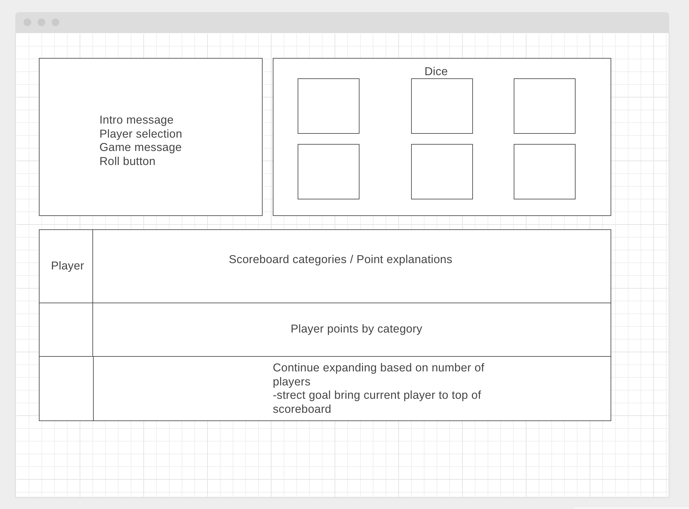
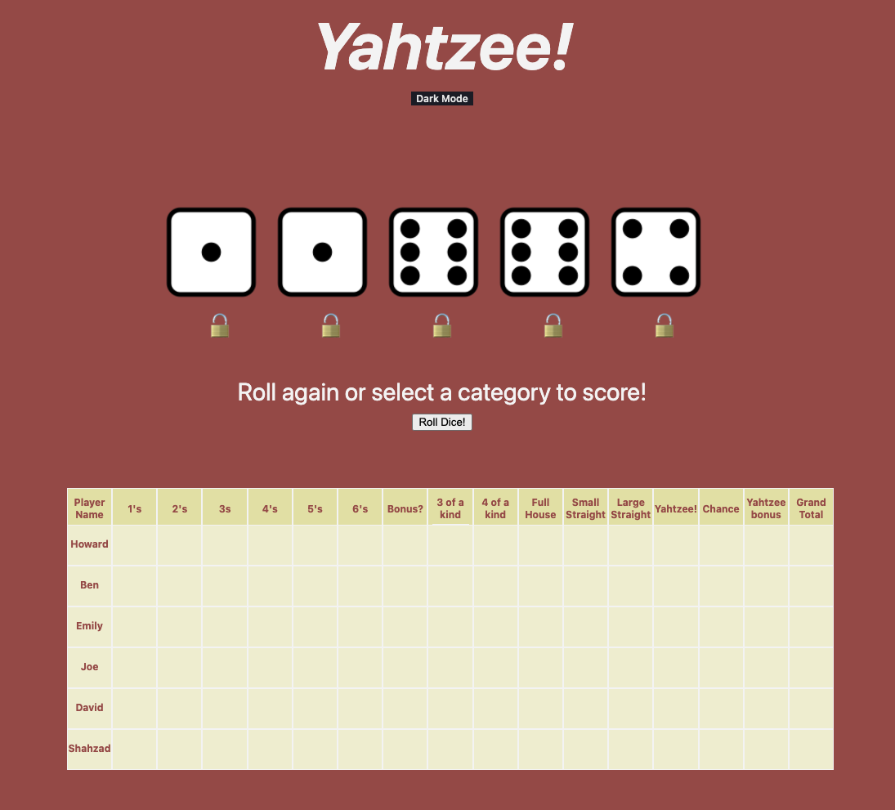

# Yahtzee Simulator

## Play the Game:
[Click Here](https://howards-yahtzee.surge.sh/)

## Objective
Create a browser based game that simulates a full game of Yahtzee allowing for between 1-6 players.

#### Why Yahtzee?
Since the beginning of the covid pandemic I've been doing a lot of virtual gaming with family and friends. My family particularly loves Yahtzee, but we all live in different regions of the country and don't all own the game. For my first major project I wanted to build a full version of the game that would allow us all play together and have a shared scoreboard. I'm happy with the final product, and am excited to share it with them.

### Pseudocode:
- Build scorecards and dice blocks in html/css
- Allow player to select between 1-6 players
- Create dice rolling function to randomly roll up to 5 dice and pair with button (and potential CSS animation)
- Build functions to sum the dice when necessary and assign total to correct field on the score board - or assign the correct score when not based on dice
- After dice are rolled allow player to select dice they do not want to be rolled again
- Allow player to lock in dice and reroll for 3 turns
- Allow player to click on category they would like to assign the points to
- Fun animation or confetti for a yahtzee
- Build in point bonus when top half of scoreboard point total is met
- Once all scoreboard categories have a score assigned to them, sum and show final score
- Final scoreboard / celebration screen for winner
- Replay button that resets board to goes to home screen
### Wireframe:

My original wireframe:

Current game in the browser, styled with CSS:

## Technologies Used:
- HTML
- CSS
- JavaScript
- git

## Credits 
- Swing animation: Animate.css
- confetti.js 

## Stretch Goals
- Update dark mode colors for scoreboard 
- Debug end game criteria/next player up for when a player gets a bonus yahtzee
- Prevent click when a score is already assigned
- Debug dice roll animation in order for animation to trigger every roll, rather than just the first.
- Add scoring criteria as a tooltip when mouse hovers over each category
- Change the background color of the scoreboard to highlight the player whose turn it currently is

